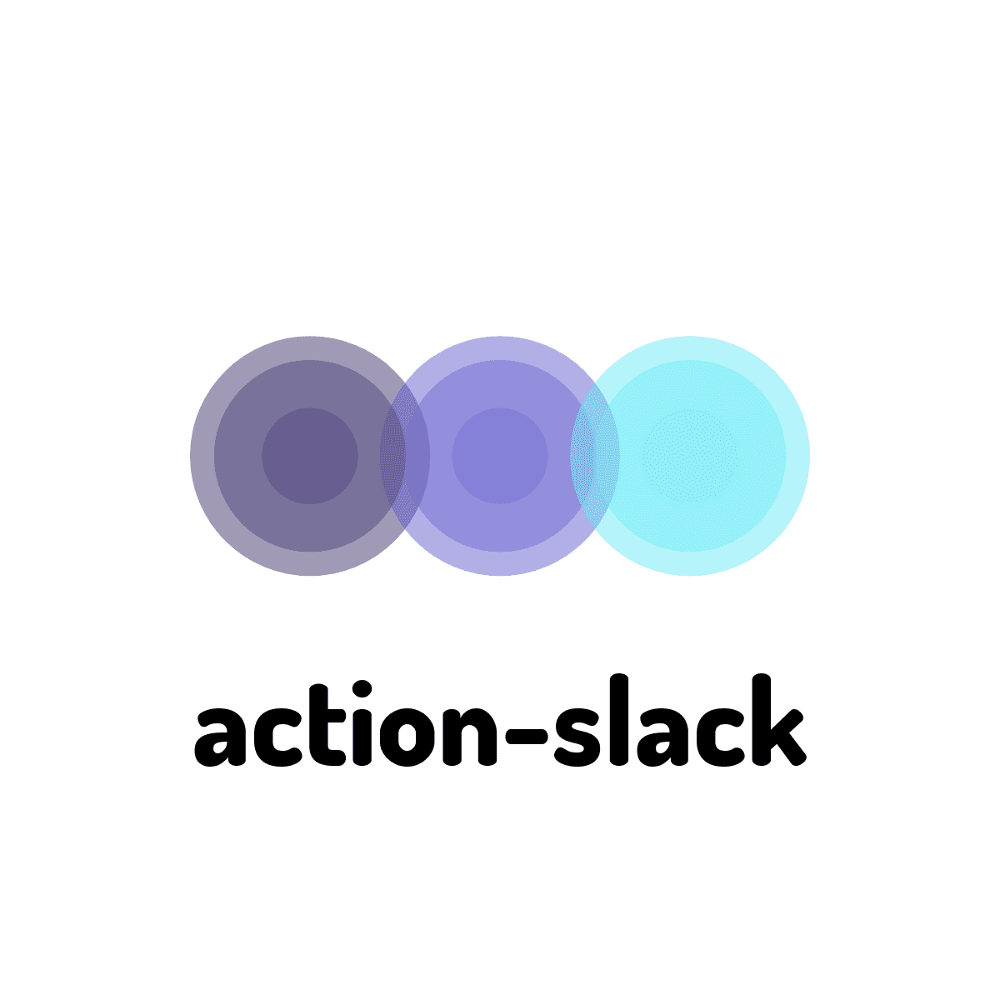

You can notify slack of GitHub Actions.

- [Usage](/usage)

# Caution

This is a v3 document under development.  
We are currently releasing v2 as a stable version.

See [here](https://github.com/marketplace/actions/action-slack) for v2 documentation.

